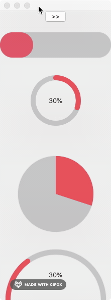

# ProgressView SwiftUI

Based on Xcode 11.6


## Reference:

https://github.com/karthironald/ProgressIndicator

https://github.com/AmeddahAchraf/Progress-Bar-SwifttUI

## Demo:




## Example code:

```swift
LinearProgress(progress: CGFloat(self.progress))
	.frame(height: 50)

CircularProgress(progress: CGFloat(self.progress))
	.frame(width: 100, height: 150)
	.overlay(Text("\(Int(progress*100))%"))

FilledCircleProgress(progress: CGFloat(self.progress))
	.frame(width: 150, height: 200)

ArcProgress(progress: CGFloat(self.progress))
	.frame(width: 200, height: 100)
	.overlay(Text("\(Int(progress*100))%"))
```

